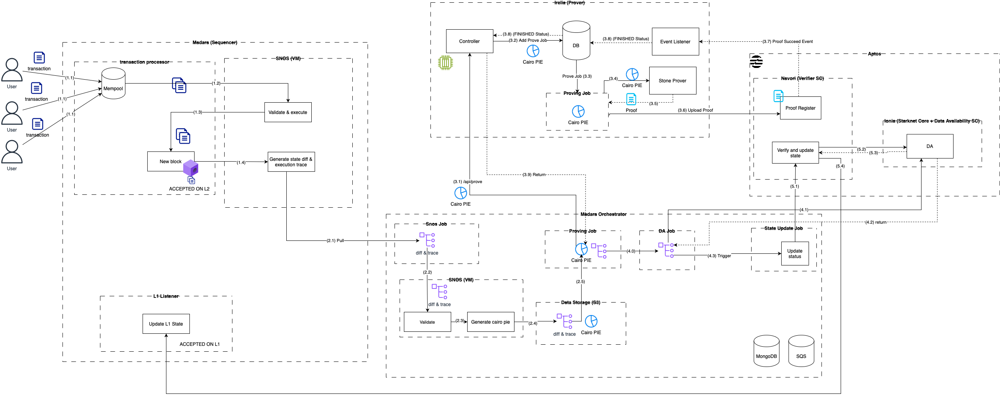

# Apstark

**Apstark** is a Layer 2 ZK-Rollup blockchain built on top of the Aptos network.

## Repositories

- [**Madara Orchestrator**](https://github.com/sota-zk-labs/madara-orchestrator): A service running alongside Madara to facilitate
  synchronization between L2 and L1.
- [**Irelia**](https://github.com/sota-zk-labs/irelia): A
  Rust-based [Sharp Prover](https://docs.starknet.io/architecture-and-concepts/provers-overview/) equivalent service for generating and
  submitting verification proofs.
- [**Madara**](https://github.com/sota-zk-labs/madara): A full node implementation for Starknet.
- [**Apstark-Kurtosis**](https://github.com/sota-zk-labs/apstark-kurtosis): A tool for setting up a fully functional devnet.
- [**Navori**](https://github.com/sota-zk-labs/navori): A verifier contract for Apstark.
- [**Ionia**](https://github.com/sota-zk-labs/ionia): A contract responsible for data availability in the rollup.
- [**Stark-EVM Adapter**](https://github.com/sota-zk-labs/stark-evm-adapter/tree/aptos-adapter): A library for parsing and manipulating
  STARK proof outputs, enabling the generation of "split proofs" required for proof verification on Ethereum.
- [**ORN**](https://github.com/sota-zk-labs/orn): A tool for managing contract constants for the verifier.
- [**ORNN**](https://github.com/sota-zk-labs/ornn): A tool for synchronizing verifier code between Solidity and Move.

## Purpose

This project aims to:

- Explore techniques for building a Layer 2 ZK-Rollup, focusing on both the engineering and research aspects, with an emphasis on the
  Starknet tech stack.
- Eventually use this stack to develop a Gaming SDK, enabling developers to create games that can handle massive user bases and
  interactions. [More on this here](future_plan.md).

## Architecture and Full Topology

The following diagram illustrates a **simplified** (not 100% matching the actual implementation) data flow, starting from when users
submit transactions to when those transactions are committed on L1 and achieve "ACCEPTED ON L1" status.

1. **Transaction processing within the L2 network (Madara)**:
    - (1.1): User transactions are placed in the Mempool.
    - (1.2): These transactions are then verified and executed within the SNOS VM.
    - (1.3): A new block is generated containing valid transactions, now marked as "ACCEPTED ON L2".

2. **Sending the new block to L1 (Madara Orchestrator)**:
    - (2.1): The new block, along with the state diff and execution trace, is fetched from Madara (handled by the SNOS job).
    - (2.2): This data is re-evaluated in the SNOS VM to ensure validity.
    - (2.3): The data is used to generate a Cairo proof, which will later be processed by Irelia to create a ZK proof.
    - (2.4): All the data is uploaded to a Data Storage (such as S3) for future use.
    - (2.5): The Proving Job retrieves the necessary data to create a proof job inside Irelia later.

3. **Proof generation and upload to Aptos (Irelia)**:
    - (3.1): The Proving Job sends a request to Irelia to generate proof and upload it to Aptos (L1).
    - (3.2): Upon receiving the request, the controller validates it and saves it in a database.
    - (3.3): The job is picked up by the Proving Job, which inputs the job's Cairo PIE into the Stone Prover to generate the proof (
      3.4, 3.5).
    - (3.6): The proof is then pushed into Aptos via the Navori contract.
    - (3.7): The event listener monitors events and updates the job status in the database (3.8).
    - (3.9): The job's result is returned to the Proving Job inside Madara Orchestrator (pulling style).

4. **Data availability (Madara Orchestrator)**:
    - (4.0): After retrieving the job's result, the DA Job picks up the state diff and execution trace from the Proving Job.
    - (4.1): It then uploads the data to the Ionia Smart Contract, receiving the result (4.2).
    - (4.3): It triggers the State Update Job.

5. **Final Step (Madara Orchestrator - Navori)**:
    - (5.1): The State Update Job calls the Navori contract.
    - (5.2, 5.3): Inside Navori, it first calls Ionia to verify that the corresponding data has been uploaded, matching the proof used
      to update the network state.
    - (5.4): It then verifies the update, transitioning the state to the next block number.
    - (5.5): Finally, Madara picks up these changes and updates the status of related transactions and blocks, marking them as "
      ACCEPTED ON L1".

## Progress - Accomplishments

> **Note:** There are still a few tasks remaining to make it fully available.

### Endpoints

- Madara RPC: http://157.66.46.183:9944
- Explorer: http://157.66.46.183:4000

### Progress

- Equivalent Verifier Smart Contract functions written in Move. (Progress: 95%)
    - Navori (Progress: 90%)
    - Ionia (Progress: 100%)
- Madara Orchestrator code enabling interaction with Aptos. (Progress: 90%)
- Madara integration code for Aptos interaction. (Progress: 50%)
- Irelia (Sharp Prover equivalent) (Progress: 80%)
- Deployment progress:
    - Aptos network (L1): (Progress: 100%)
    - Madara (L2): (Progress: 100%)
    - Contract deployment: (Progress: 20%)
    - Madara Orchestrator: (Progress: 20%)
    - Other auxiliary services: (Progress: 50%)